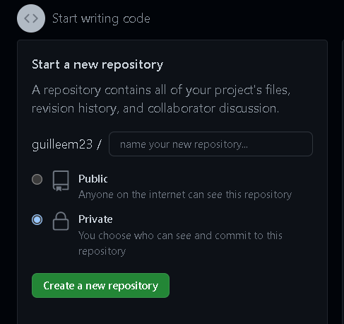

# ASIX1_M4UFA-1_Documentaci-n_GuillemAbad
<!DOCTYPE html>
<html lang="en">
<head>
    <meta charset="UTF-8">
    <meta http-equiv="X-UA-Compatible" content="IE=edge">
    <meta name="viewport" content="width=device-width, initial-scale=1.0">
    
</head>
<body>
 <center><h1><u><strong>DOCUMENTACIÓN APUNTES:</strong></u></h1> <align=”middle”>    </center>
<H2>GIT HUB:</H2>
Primero de todo, para poder empezar a trabajar con GitHub y Visual Code tenemos que tener creada en internet una cuenta de GitHub. Seguidamente, vamos a nuestro perfil y le damos a crear un repositorio nuevo. En este, lo ponemos en público o privado dependiendo si queremos que lo vea la gente de internet o solamente la gente que nosotros queramos y <strong>MUY IMPORTANTE</strong> darle a "add a read me file" ya que ahí es donde puede escribir una descripción larga del proyecto que vamos a crear.
<br><br><br><br>
<br>
<br>
Una vez creado el repositorio, como nosotros queremos trabajar en local (es decir desde nuestro pc y no directamente desde GitHub), tendremos que hacer una copia para subirla a nuestro local. Para hacerlo, vamos a seguir los siguientes pasos:
<br>

<li>Abrimos el CMD</li>
<li>Escribimos "cd" y le damos a enter</li>
<li>Escribimos "cd" y en donde quieres que se quede guardado y le damos a enter. Ejemplo: cd C:\repositorios GIT</li>
<li>Una vez hecho esto, escribimos "git clone" y el link de la página anteriormente creada de nuestro repositorio de GitHub (para encontrarlo, vamos a nuestro repositorio de GitHub, pulsamos en code y copiamos la URL que sale) y le damos a enter. Ejemplo: git clone https://github.com/guilleem23/-ejemplo123.git</li>
<br>
Después de haber seguido estos pasos, ya podremos seleccionar desde local la carpeta del local donde está ubicado nuestro repositorio. 
<br>
Una vez hecho esto, abriremos la carpeta y crearemos dos cosas.
<li>1. Una carpeta llamada img donde guardaremos todas las imágenes que necesitaremos posteriormente</li>
<li>2. Un archivo llamado index.html para así ir viendo el trabajo que estamos realizando. Este posteriormente será nuestro resultado final de nuestra página web.</li>
<br>
<br>
Después de haber acabado ya todo lo que necesitamos para crear la página con todo lo necesario, para subir desde local al GitHub nuestra carpeta del repositorio tendremos que hacer lo siguiente:
<li>1o tendremos que abrir CMD</li>
<li>2o escribimos cd y le damos a enter</li>
<li>3o escribimos cd y la ubicación del nuestra carpeta del repositorio. Ejemplo: cd C:\repositorios GIT\ASIX1_M4UF1A4_primer_HTML_GuillemAbad</li>
<li>4o escribimos "git init" y le damos a enter</li>
<li>5o escribimos "git add" y le damos a enter</li>
<li>6o escribimos 'git commit -m "(el cambio que le queremos dar)'. Ejemplo: git commit -m "cambio del error del HTML" </li>
<LI>7o escribimos "git push origin main" para acabar ya y le damos a enter</LI>
<br>
Una vez hecho esto, iremos a nuestro repositorio de GitHub en la nube y veremos que nos salen 3 cosas, el index.html creado, la read me file creada al principio y la carpeta img donde hemos guardado todas las imágenes necesarias para hacer este proyecto.
<br> Para ver el resultado final de la página y poderlo compartir, nos iremos a "settings" del repositorio, "pages", y desplegamos donde pone "none" con el título de "branch" y seleccionamos "main". A continuación nos esperamos y vamos recargando hasta que salga ya nuestra página web HTML. 
<br> Finalmente, ya tendremos el link de nuestra página web y para poder compartirla solamente tendremos que darle este link a quién queramos para hacerlo ya público. En mi caso, como también quiero que mi profesor vea lo demás, es decir, a parte del archivo index.html, que vea también la carpeta llamada img y el archivo read me file, nos vamos a code y copiamos al portapapeles lo que nos sale en HTTPS y ya estaría.
<br>
<H2>MARKDOWN:</H2>
<h4>Etiquetas básicas de Markdown:</h4>
<li>Para hacer los encabezados, estos ya vienen asociados ya un estilo por defecto a cada uno. Sería de la siguiente forma:
    <br># H1
    <br>## H2
    <br>### H3
    <br>#### H4
    <br>##### H5
    <br>###### H6</li>
    <br>
<li>Estilos de letra:

    <br>Itálica o cursiva: *texto* o _texto_
    <br>Negrita: **texto** o __texto__
    <br>: ~~palabra~~ (ALT+126)
   <br> Anidar estilos: **palabra1  _palabra2_** (itálicas pero la segunda además negrita)
    </li>
    <br>
 <li>Listas:
  <strong>ORDENADAS</strong> 
  <BR>  1. Primer elemento de lista
   <br> 2. Segundo elemento de lista
      <br>  (El número de orden no ha de ser necesariamente consecutivo)
    <br>Tabulación→ 1. Elemento de sublista ordenado
    
   <strong>DESORDENADAS</strong>
   <br> *  Elemento de lista desordenada
   <br> -  Otro elemento de lista desordenada
    <br>+ Otro elemento de lista desordenada
   <br>     (Se puede elegir cualquiera de los tres símbolos para crear una lista desordenada)
    <br>Tabulación→ * Elemento de sublista desordenado</li>   
  <br>  <li><strong>Párrafos</strong>
    <br>Para crear un bloque de texto nuevo (etiqueta), se introduce una línea en blanco.
    </li>
    <br>
    <li><strong>Código</strong>
    <br>El código se ha de incluir entre acentos graves (`). Si en el código aparece un acento grave, se ha de introducir el carácter dos veces al principio de la sección del código.

    <br>``Todo esto es `código`.``
    
    <br>También se puede marcar el área correspondiente al código insertando tres acentos graves al principio y al final. Junto a los tres iniciales se puede indicar el lenguaje (HTML, JavaScript) para que incluso se muestre con los colores adecuados:
    
    <br>```html
    <br><'html'>
     <br> <'head'>
     <br> <'/head'>
    <br><'/html'>
  <br><li><strong>Enlaces</strong>
<br>[Link](https://ejemplo.com/ "Título opcional del enlace")

<br>a) Primero se incluye el texto del link entre corchetes y posteriormente el link entre paréntesis).    
<br>b) El “título opcional del enlace” es el texto alternativo al pasar el ratón por encima.

<br>Reference-style: 
<br>![alt text][logo]
<br>[logo]: https://github.com/adam-p/markdown-here/raw/master/src/common/images/icon48.png "Logo Title Text 2"

</li>
<br><li><strong>Tablas</strong>
<br> | Tables        | Are           | Cool  |
<br>| ------------- |:-------------:| -----:|
<br>| col 3 is      | right-aligned | $1600 |
<br>| col 2 is      | centered      |   $12 |
<br>| zebra stripes | are neat      |    $1 |

<br>Los dos puntos se usan para alinear las columnas (izquierda, centrado, derecha).
<br>No es necesario que estén alineadas verticalmente. Solo a nivel visual para claridad del código.
<br>Se han de poner al menos tres guiones para separar cada encabezado
<br>
<li><strong>Notas al pie de página</strong>

 <br>   Texto con enlace a nota de pie de página [^1]
    
  <br>  [^1]: Aquí encuentras el texto de la nota al pie de página.
    
<li><strong>Listas de verificación</strong>
<br>- [ ] A
<br>- [x] B
<br>- [ ] C
 <br> (Dejar un espacio en blanco entre los dos corchetes en las que aparezcan vacías)


</li>

<h2>HTML:</h2>
Visual Studio Code, se utiliza y/o lo hemos utilizado con HTML. Para empezar a trabajar con este de manera fácil, tendremos que escribir "html:5" y nos desplegará un texto para poder empezar a darle forma a nuestro proyecto. 
<br><br><br><br>
Por ejemplo, podemos ponerle título a este, donde pone <"title">. A continuación, hay unas cosas básicas que debes de saber:
<br><li>El <'br'> sirve para dejar un espació. Aunque nosotros le demos a enter desde el Visual Studio Code, si no escribimos <'br'> sin las comillas no dejará un espacio.
 </li>
<li>El <'li'>Sirve para hacer una lista mediante puntos como estás viendo ahora mismo leyendo estos puntos.</li>
<li>Los H1,H2,H3,H4,H5... sirven para hacer títulos, el número más pequeño (1) para títulos más grandes y a medida que incrementas el número se van haciendo más pequeños</li>
<li>Cuando nosotros utilizamos la 'hr', esta se utiliza para hacer una línea/barra horizontal que ocupa toda la línea de página. 
    <HR>ESTO ES UN EJEMPLO<HR>
  <LI>Y lo siguiente sirve para poder darle un destino a un texto. Ejemplo:  <'a href=”destinodeltexto”>texto a escribir <'/a></LI>  

</li>
<li>Para introducir una imagen, tendremos que escribir lo siguiente:<'img src="/ubicacióndelaimagen"'> </li>
<li>Para hacer listas mediante números, tendremos que utilizar la herramiente <'ol'> y la herramienta anteriormente utilizada <'li'></li>
<br>
<br>
En resumen del lenguaje de HTML, podemos decir que es un lenguaje de marcado que se utiliza para estructurar y dar formato a contenido en la World Wide Web. Estos son algunos de los elementos más básicos que se utilizan:
<br>
Elementos: cada pieza de contenido en un documento HTML se envuelve en un elemento. Los elementos tienen una etiqueta de apertura y una etiqueta de cierre, y el contenido se encuentra entre ellas. Por ejemplo, el elemento <'p'> se utiliza para crear un párrafo y se escribe así: <'p'>Contenido del párrafo<'/p'>.
<br>
Atributos: los elementos a menudo tienen atributos, que son pares de nombres y valores que proporcionan información adicional sobre el elemento. Por ejemplo, el elemento <'img'> se utiliza para insertar imágenes en una página y tiene un atributo "src" que indica la ubicación de la imagen. Una imagen se escribiría así: <'img src="imagen.jpg"'>.
<br>
Enlaces: el elemento <'a'> se utiliza para crear enlaces a otras páginas o recursos en la Web. Por ejemplo, <'a href="https://www.ejemplo.com"'>Enlace</'a'> crearía un enlace que dice "Enlace" y lleva al sitio web "https://www.ejemplo.com" cuando se hace clic.
<br>
Encabezados: los elementos <'h1'> a <'h6'> se utilizan para crear títulos y encabezados. El elemento <'h1'> se utiliza para el título principal y los elementos <'h2'> a <'h6'> se utilizan para los encabezados secundarios.
<br>
Listas: los elementos <'ul'> y <'ol'> se utilizan para crear listas no ordenadas y ordenadas, respectivamente. Cada elemento de la lista se envuelve en un elemento <'li'>.
<br>
Tablas: el elemento <'table'> se utiliza para crear tablas con filas y columnas. Las filas se envuelven en elementos <'tr'>' y las celdas se envuelven en elementos <'td'>.

<br>


<h2>FONT AWESOME</h2>
<li>Para nosotros poder poner distintos iconos y demás en nuestra página HTML, utilizamos la siguiente web: <a href="https://fontawesome.com/"> Font Awesome.</a></li>
<li>Entramos y nos registramos y seguimos los siguientes pasos:</li>
<ol><li>Después de registrarnos, nos vamos donde pone "icons" y buscamos el icono que más nos guste. Si no queréis pagar, darle a filtrar por "free" para seleccionar los iconos gratuitos. Una vez seleccionado el icono, copiamos al portapapeles lo que pone donde lo de HTML.</li>
<li>Seguidamente, dentro de nuestro visual studio, introducimos lo anteriormente copiado exactamente donde queramos que se vea. (tiene que ser donde tú quieras pero donde pone "body" y no "head"</li>
<li>Finalmente, para que se vea, vamos a nuestro perfil, le damos a "kits" y si tenemos un kit lo copiamos al portapapeles toda la url y sino, creamos un kit y hacemos el paso anterior.</li><br><br>

<br><br>
<li>Entonces, lo anteriormente copiado al portapapeles, el cuál es el kit code de nuestro proyecto, lo pegamos en el Visual Studio pero <strong>DONDE PONE <'head'></strong>, si no no funcionará. El script este que hemos utilizado siempre es el mismo, por lo cual siempre lo podremos utilizar en nuestros futuros proyectos.</li></ol>

<h2>CCS</H2>
<br>
CSS (Cascading Style Sheets, o Hojas de Estilo en Cascada) es un lenguaje utilizado para describir la presentación de documentos escritos en HTML y otros lenguajes de marcado. Algunos de los conceptos básicos de CSS incluyen:
<br><br>
Seleccionadores: los seleccionadores se utilizan para seleccionar elementos en un documento HTML para aplicar estilos. Por ejemplo, el seleccionador de etiqueta selecciona todos los elementos de un tipo específico, como p para seleccionar todos los párrafos en un documento. Los seleccionadores de clase y ID también se pueden utilizar para seleccionar elementos con una clase o ID específico.
<br><br>
Propiedades: las propiedades son características de los elementos que se pueden modificar con CSS. Por ejemplo, la propiedad "color" se utiliza para cambiar el color del texto de un elemento y la propiedad "font-size" se utiliza para cambiar el tamaño de la fuente.
<br><br>
Valores: cada propiedad tiene un conjunto de valores posibles que se pueden utilizar para modificar el aspecto de un elemento. Por ejemplo, el valor "red" se puede utilizar para cambiar el color del texto a rojo y el valor "12px" se puede utilizar para cambiar el tamaño de la fuente a 12 pixeles.
<br><br>
Reglas: una regla CSS consta de un seleccionador y un conjunto de declaraciones que especifican las propiedades y sus valores para ese seleccionador. Por ejemplo, la regla p {color: red; font-size: 12px;} cambiaría el color y el tamaño de la fuente de todos los párrafos a rojo y 12 pixeles, respectivamente.
<br><br>
Herencia: algunas propiedades se heredan de un elemento padre a sus elementos hijos. Por ejemplo, si se establece el color del texto de un elemento padre como rojo, todos sus elementos hijos también tendrán el texto en rojo a menos que se sobrescriba explícitamente con un valor diferente.
<br><br>
Diseño en cascada: el término "cascada" en CSS se refiere a cómo los estilos se aplican a un documento. Si hay varias reglas que aplican estilos a un elemento, la última regla en la cascada tiene prioridad sobre las anteriores.
<br><br>
Seguidamente, dentro de CSS también tenemos diferentes tipos de selectores, cada uno de los cuales corresponde con una parte diferente del etiquetado. Los tres más básicos son los siguientes:
<br><br>
<li>1) Selector de elementos. 
<br>
<br>Corresponde con todos los elementos de este nombre en la página. El siguiente ejemplo afectaría a TODOS los elementos <'a'> del documento HTML:
<br>
<br>
/* All <'a'> elements. */
<br>a {
<br>   color: red;
<br>}
<br>
<li>2) Selector de clase.
<br> Corresponde con todos los elementos que tengan el atributo class con el valor especificado. Por ejemplo el selector:
<br>
.example {
 <br>  property: value;
 <br>  property2: value2;
<br>}

<br>afectaría a los siguientes elementos HTML:

<br><'p class="example"'>
<br> <'li class="example"'>
<br> <'div class="example"'>
<br><li>3) Selector de id.
<br>
<br> Corresponde a todos los elementos HTML que tienen un atributo id con el valor especificado.
<br>Por ejemplo el selector:
<br>
#example {
<br>   property: value;
 <br>  property2: value2;
<br>}
<br><br>
afectaría al siguiente elemento HTML (puede haber más de uno con el mismo ID): <¡p id="example"¡>
<br>
Además de estos selectores, también disponemos de <strong>selectores avanzados <strong> que son los siguientes:
<br>
<br>
<li>
Selectores universales.
<br>
<br> Sirven para seleccionar todos los elementos de la página. En el  ejemplo, todos los elementos han de tener un borde solido negro de un pixel:
<br>
 <br>  * {
 <br>        border: 1px solid #000000;
 <br>  }
<br>
Selectores de atributos. Permiten seleccionar elementos en función de los atributos que contienen. En el ejemplo quedan afectados todos los elementos <'img'> con un atributo “alt”.
  <br> 
  <br> img[alt] {
   <br>   border: 1px solid #000000;
  <br> }
<br>
Es más útil si se especifica el valor del atributo:
<br>

   img[src="alert.gif"] {
   <br>   border: 1px solid #000000;
  <br> }
<br>
<li>Selectores de hijos. 
<br>Para seleccionar elementos concretos que son hijos DIRECTOS de otros elementos concretos. Por ejemplo, esta regla pone de color azul el texto de los elementos <'strong'> que son hijos de <'h3'> pero no el resto de elementos <'strong'>
<br>
<br>   h3>strong {
  <br>    color: blue;
 <br>  }
<br>
<li>Selectores de descendientes. 
<br>Similar al selector de hijos pero, a diferencia de ellos, que solo seleccionan elementos descendientes DIRECTOS, los selectores de descendientes seleccionan los elementos pertinentes EN CUALQUIER PUNTO de la jerarquía del elemento.
<br>
<li>Selectores de hermanos adyacentes.
<br> Permiten seleccionar un elemento concreto que aparece DIRECTAMENTE DESPUÉS de otro elemento concreto al mismo nivel de la jerarquía del elemento. Por ejemplo si quisiéramos reducir el espacio vertical entre el <'h1'> y el primer <'h2'> pero no afectar al segundo <'h2'> en el código siguiente:
<br>
 <br>  <'h1'>Encabezado 1 <'/h1'>
  <br> <'h2'>Encabezado 2 (hermano adyacente) <'/h2'>
  <br> <'h2'>Encabezado 2 (hermano no adyacente) <'/h2'>
<br>
Definiríamos la regla siguiente:
<br>
 <br>  h1+h2 {
  <br>    margin-top: -5mm;
 <br>  }

<br>
<li>Pseudoclases. 
<br>Se utilizan para definir estilos, no para los elementos sino para los diversos estados de los elementos:
<br>

<br> : 'link': El estado normal por defecto de los enlaces. Tal y como se ven por primera vez.
<br>:visited: Enlaces que ya se han visitado con el navegador que se está utilizando.
<br>:focus: Enlaces (o campos de formularios, o cualquier otra cosa) que tienen en ese momento el cursor en su interior.
<br>:hover: Enlaces que tienen en este momento el puntero del ratón sobre ellos.

<br>
<li>Pseudoelementos. 
<br>Como las pseudoclases no afectan a todo el elemento sino que permiten añadir estilos a UNA PARTE CONCRETA del documento. Por ejemplo, el pseudoelemento ::first-line selecciona solo la primera línea del elemento especificado por el selector.
<br>
   selector::pseudo-elemento { propiedad: valor; }
<br>
 <br>  /* Selecciona la primera línea de un <'p'> */
 <br>  p::first-line {
  <br>   color: red;
 <br>  }

<h3>Margenes, bordes y relleno en CSS</h3>
<br>
<br>

<br>
<br>
Los márgenes, bordes y relleno son características importantes en CSS que se pueden utilizar para controlar el espacio y el diseño de los elementos en una página web.
<br>
<br>
Los márgenes son el espacio alrededor de un elemento. Pueden utilizarse para separar un elemento de otros elementos o del borde de la página. Los márgenes se pueden establecer con la propiedad "margin" y pueden tener diferentes valores para cada lado del elemento. Por ejemplo, para establecer un margen de 10 pixeles en todos los lados de un elemento, se puede utilizar la siguiente regla:
<br>
<br>elemento {
<br>  margin: 10px;
<br>}
<br>
<br>
Los bordes son líneas que rodean un elemento y pueden utilizarse para separar un elemento de otros elementos o del fondo de la página.<br><br> Los bordes se pueden establecer con la propiedad "border" y pueden tener diferentes estilos, colores y anchuras.
<br><br> Por ejemplo, para establecer un borde rojo de 5 pixeles de ancho con un estilo sólido, se puede utilizar la siguiente regla:
<br>
<br>
<br>elemento {
  <br>border: 5px solid red;
<br>}
<br>
<br>
El relleno es el espacio dentro de un elemento, entre el contenido y el borde. Se puede utilizar para controlar el espacio entre el contenido y el borde de un elemento.<br><br> El relleno se puede establecer con la propiedad "padding" y puede tener diferentes valores para cada lado del elemento. <br><br>Por ejemplo, para establecer un relleno de 10 pixeles en todos los lados de un elemento, se puede utilizar la siguiente regla:
<br><br>
<br>elemento {
 <br> padding: 10px;
<br>}
<br><br>
En resumen, podemos decir que las propiedades de CSS son las características de los elementos a las que se les puede aplicar un estilo. Algunas propiedades comunes son:

<br><li>color: establece el color del texto

<br><li>font-size: establece el tamaño de la fuente

<br><li>background-color: establece el color de fondo de un elemento

<br><li>width: establece el ancho de un elemento

<br><li>height: establece la altura de un elemento

<br><li>margin: establece el margen alrededor de un elemento

<br><li>padding: establece el espacio entre el contenido de un elemento y sus bordes

<br><li>Herencia: cuando se aplican estilos a un elemento, estos también se heredan por defecto a sus elementos hijos. Esto significa que si se establece el color de texto en rojo en un elemento div, todos los elementos hijos de ese div también tendrán el texto en rojo, a menos que se les apliquen estilos específicos que anulen la herencia.
<br>
<br><li>Selectores múltiples: se pueden aplicar estilos a múltiples elementos al mismo tiempo usando selectores múltiples. 
<br>Por ejemplo:
<br><br>h1, h2, h3 {
 <br> color: blue;
<br>}
<br>
<br>
<li>Clases y ID: las clases y los ID se pueden usar para aplicar estilos a elementos específicos en una página. Las clases se pueden usar en varios elementos de la página, mientras que los ID solo se deben usar en un único elemento. Por ejemplo:
<br>
<br>
<br><'p class="important">Este es un párrafo importante.<'/p>
<br><'p class="important">Este es otro párrafo importante.<'/p>
<br><br>
<br><'div id="header">Este es el encabezado de la página.<'/div>
<br>
<br>
<br>.important {
<br>  font-weight: bold;
<br>}
<br><br>
<br>#header {
<br>  background-color: blue;
<br>}


<br>
<br><li>Margin (margen):
<br> Representan el espacio que la separará de los elementos contiguos. 
<br>- margin-top (margen superior)
<br>- margin-right (margen derecho)
<br>- margin-bottom (margen inferior)
<br>- margin-left (margen izquierdo)
<br>
<li>Border (bordes):
<br> Representan el estilo que tendrán los bordes del elemento:
<br>- border-top
<br>- border-right
 <br>- border-bottom 
 <br>- border-left
<br><li>Padding (relleno):
<br>Es el espacio entre el borde del elemento y su contenido. 
<br>
Como en todas, se derivan otras 4 propiedades:
<br>- padding-top
<br>- padding-right
 <br>- padding-bottom 
<br>- padding-left


</body>

</html>
